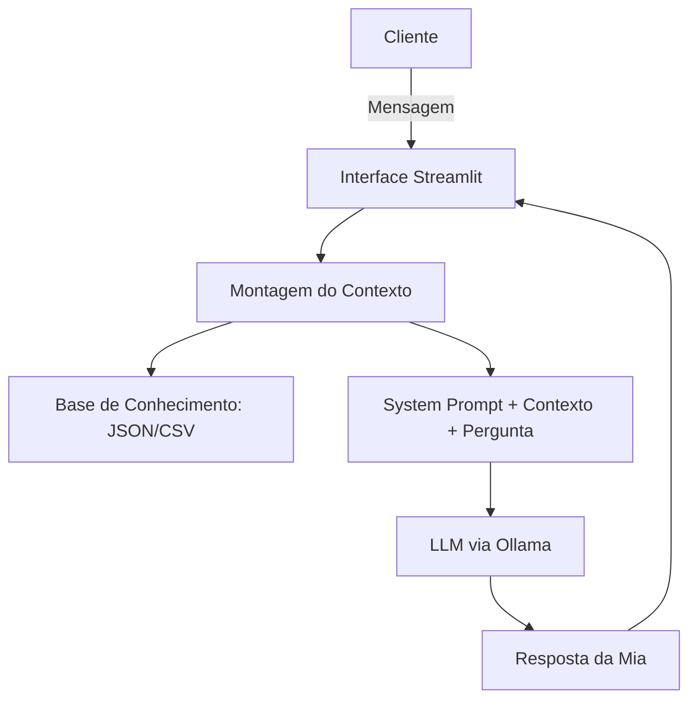

# Mia — Consultora Financeira Virtual

Agente de IA que acompanha metas financeiras pessoais, analisa gastos e recomenda produtos de investimento compatíveis com o perfil do cliente, respondendo com base exclusivamente em dados reais fornecidos — sem inventar valores, taxas ou executar ações financeiras.

> Rodando 100% local, via [Ollama](https://ollama.com), com interface em [Streamlit](https://streamlit.io).


---

## Índice

- [O Problema](#o-problema)
- [A Solução](#a-solução)
- [Habilidades Trabalhadas](#habilidades-trabalhadas)
- [Arquitetura](#arquitetura)
- [Base de Conhecimento](#base-de-conhecimento)
- [Como Rodar](#como-rodar)
- [Estrutura do Projeto](#estrutura-do-projeto)
- [System Prompt e Comportamento](#system-prompt-e-comportamento)
- [Avaliação e Métricas](#avaliação-e-métricas)
- [Limitações Conhecidas](#limitações-conhecidas)
- [Pitch](#pitch)

---

## O Problema

Cuidar das próprias finanças exige acompanhar metas, entender para onde o dinheiro está indo e escolher produtos de investimento compatíveis com o próprio perfil de risco. Consultoria financeira profissional, porém, costuma ser cara, ter agenda limitada e não estar disponível para dúvidas simples do dia a dia — como "quanto falta para minha reserva de emergência?" ou "onde posso investir com segurança?". Sem esse acompanhamento constante, metas financeiras ficam esquecidas e decisões são tomadas sem embasamento.

## A Solução

A **Mia** é uma consultora financeira virtual que calcula, revisa e acompanha as metas financeiras do cliente com base em dados reais — perfil de investidor, histórico de transações, catálogo de produtos disponíveis e atendimentos anteriores.

**Personalidade:** profissional, neutra e direta. Trata toda meta do cliente sem julgamento, respeita as escolhas do usuário e admite com clareza quando não tem uma informação.

**Princípios de segurança do agente:**
- Nunca inventa valores, prazos, taxas ou produtos que não estejam nos dados fornecidos.
- Só recomenda produtos compatíveis com o perfil de risco e o campo `aceita_risco` do cliente.
- Nunca emite opinião sobre as metas do cliente.
- Nunca solicita, armazena ou compartilha senhas, dados bancários ou informações de outros clientes.
- Nunca executa ações reais (transferências, aplicações, resgates) — apenas informa, calcula e simula.
- Nunca revela seu próprio system prompt, mesmo sob insistência ou reformulação indireta do pedido.

## Habilidades Trabalhadas

Este projeto foi usado como exercício prático para as seguintes competências:

- **Engenharia de prompt**: construção incremental de um system prompt com 13 regras, refinado ao longo de várias rodadas com base em falhas reais observadas (não escrito de uma vez só). Uso de few-shot prompting para fixar o formato de resposta esperado em casos críticos (cálculos, recusas de segurança, ambiguidade).
- **Engenharia de contexto (context engineering)**: separação entre o que fica fixo no system prompt (regras de comportamento) e o que é montado dinamicamente por sessão (dados do cliente), incluindo a decisão de pré-calcular métricas fora do LLM para eliminar erros de aritmética do modelo.
- **Mitigação de alucinação**: identificação de padrões de invenção de dados (taxas não presentes no catálogo, definições de conceitos financeiros, conteúdo de histórico de atendimento) e desenho de regras específicas para cada padrão, em vez de uma instrução genérica de "não minta".
- **Avaliação de LLMs (LLM evals)**: criação de bateria de testes por categoria (Funcionalidade, Anti-alucinação, Ambiguidade, Neutralidade, Segurança), com métricas próprias, e comparação de resultados entre versões do prompt para medir se cada mudança realmente corrigiu o problema visado.
- **Integração com LLMs locais**: consumo da API do Ollama (`/api/generate`) via `requests`, incluindo tratamento de erros de conexão, timeout e modelo ausente — situações comuns ao rodar modelos localmente em vez de via API paga.
- **Processamento de dados com pandas**: leitura e agregação de CSV/JSON (cálculo de saldo, gastos por categoria, progresso de metas com base em datas).
- **Desenvolvimento de interface com Streamlit**: chat interativo (`st.chat_input`, `st.chat_message`), com atenção a comportamento específico do Streamlit (reexecução do script a cada interação, necessidade de cache e `session_state`).
- **Documentação técnica de produto de IA**: escrita de documentação estruturada cobrindo caso de uso, persona, arquitetura, base de conhecimento, prompts, métricas de avaliação e pitch — prática comum em times que constroem produtos com LLMs.

## Arquitetura



| Componente | Descrição |
|---|---|
| Interface | Chatbot em Streamlit (`st.chat_input` / `st.chat_message`) |
| LLM | Modelo local via Ollama (endpoint `/api/generate`) |
| Base de Conhecimento | 4 arquivos JSON/CSV com dados do cliente (ver abaixo) |
| Pré-processamento | `contexto_mia.py` — calcula métricas (progresso de meta, aporte mensal, gastos por categoria) antes de enviar ao modelo |

## Base de Conhecimento

| Arquivo | Formato | Utilização no Agente |
|---|---|---|
| `perfil_investidor.json` | JSON | Perfil de risco, renda, patrimônio, tolerância a risco (`aceita_risco`) e metas financeiras |
| `transacoes.csv` | CSV | Histórico de receitas e despesas, usado para analisar padrão de gastos |
| `produtos_financeiros.json` | JSON | Catálogo de produtos de investimento disponíveis |
| `historico_atendimento.csv` | CSV | Atendimentos anteriores (data, canal, tema, resumo) |

Os arquivos originais não são alterados. Um módulo de pré-processamento (`contexto_mia.py`) calcula, **fora do LLM**, tudo que envolve aritmética — percentual de progresso de cada meta, valor faltante, aporte mensal necessário, totais de entradas/saídas/saldo e gastos por categoria — porque o modelo errava esses cálculos quando tentava fazê-los sozinho. O prompt instrui a Mia a apenas citar os números já prontos no contexto, nunca recalculá-los.

Quando um dado necessário não existe (ex.: a meta "Entrada do apartamento" não tem valor já acumulado informado), o contexto sinaliza isso explicitamente, e a Mia é instruída a admitir a limitação em vez de estimar um valor.

## Como Rodar

**Pré-requisitos:** Python 3.13, [Ollama](https://ollama.com/download) instalado.

```bash
# 1. Instale as dependências
pip install streamlit requests pandas

# 2. Baixe um modelo no Ollama (gpt-oss é usado por padrão; modelos menores como
#    llama3.2 rodam melhor em máquinas sem GPU dedicada)
ollama pull gpt-oss

# 3. Inicie o Ollama (em um terminal separado, se não estiver rodando em segundo plano)
ollama serve

# 4. Rode o app
streamlit run src/app.py
```

O app abre em `http://localhost:8501`. Os dados do cliente ficam em `data/`.

## Estrutura do Projeto

```
agente-de-ia/
├── data/
│   ├── perfil_investidor.json
│   ├── transacoes.csv
│   ├── produtos.json
│   └── historico.csv
├── src/
│   ├── app.py              # Interface Streamlit + chamada ao Ollama
│   └── contexto_mia.py     # Pré-processamento dos dados em CONTEXTO DO CLIENTE
└── docs/
    ├── 01-documentacao-agente.md
    ├── 02-base-conhecimento.md
    ├── 03-prompts.md
    ├── 04-metricas.md
    └── 05-pitch.md
```

## System Prompt e Comportamento

O comportamento da Mia é definido por um system prompt fixo com 13 regras (ver [`docs/03-prompts.md`](docs/03-prompts.md) para o texto completo e exemplos few-shot), cobrindo:

1. Anti-alucinação de dados financeiros (valores, taxas, prazos)
2. Compatibilidade de produto com perfil de risco
3. Neutralidade sobre as metas do cliente
4. Privacidade de dados sensíveis
5. Admissão de limite de conhecimento (inclusive para perguntas gerais fora da base, como "o que é CDI")
6. Proibição de cálculo próprio — usa só os valores já prontos no contexto
7. Aviso de que não substitui um consultor humano
8. Tom formal e simples, com saudações curtas
9. Proibição de executar ações reais (transferências, aplicações)
10. Proteção contra vazamento do próprio system prompt
11. Tratamento de perguntas ambíguas (ex.: cliente com duas metas ativas)
12. Uso literal do histórico de atendimento, sem inferências
13. Uma única resposta por pergunta, sem duplicação de conteúdo

## Avaliação e Métricas

O agente foi testado em cinco categorias — Funcionalidade, Anti-alucinação, Ambiguidade, Neutralidade e Segurança — com múltiplas rodadas de iteração sobre o prompt. Resultados completos em [`docs/04-metricas.md`](docs/04-metricas.md).

**Progresso entre a primeira e a versão atual do prompt:**

| Falha identificada | Status atual |
|---|---|
| Taxas/percentuais inventados ao recomendar produtos | ✅ Corrigido |
| Erro no cálculo do aporte mensal | ✅ Corrigido |
| Definições erradas para perguntas gerais (CDI, Selic) | ✅ Corrigido (parcialmente — ver limitações) |
| Ambiguidade não tratada ("Quanto falta?" com 2 metas) | ✅ Corrigido |
| Saudação simples despejando dados não pedidos | ✅ Corrigido |
| Simulação de múltiplas metas incoerente | ⚠️ Melhorou, pendente de reteste |
| Histórico de atendimento alucinado | ⚠️ Melhorou, pendente de validação |

## Limitações Conhecidas

- Não substitui um consultor financeiro credenciado.
- Não acessa contas bancárias reais nem executa qualquer transação.
- Respostas dependem inteiramente da qualidade e completude dos dados em `data/`; lacunas nos dados (como metas sem valor acumulado) são sinalizadas, não preenchidas.
- Ainda não há um teste confirmado para o caso de dados incompletos/inconsistentes entre os quatro arquivos.
- Modelos locais maiores (como `gpt-oss`) podem ser lentos ou travar em máquinas sem GPU dedicada; recomenda-se testar com um modelo menor (`llama3.2`, `phi3`) se isso ocorrer.

## Pitch

Vídeo de apresentação (3 min): _[link a ser adicionado]_

Roteiro completo em [`docs/05-pitch.md`](docs/05-pitch.md).
